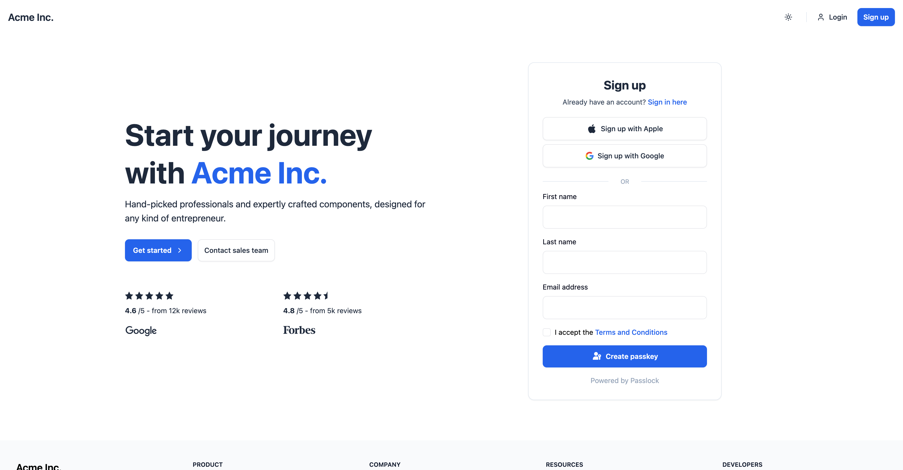

<!-- PROJECT LOGO -->
<div align="center">
  <a href="https://github.com/passlock-dev/passkeys-frontend">
    
  </a>
</div>

<a name="readme-top"></a>

<h1 align="center">SvelteKit Passkey Starter</h1>
  <p align="center">
    Starter project illustrating Passkey authentication, Google sign in and mailbox verification.
    <br />
    <a href="https://d1rl0ue18b0151.cloudfront.net">Demo</a>
</div>

<div align="center">
  <picture align="center">
    <source srcset="static/repo-banner.dark.svg" media="(prefers-color-scheme: dark)" />
    
  </picture>
</div>

<br />



<p align="center">Creating a new account and passkey</p>

**Shadcn/ui variant**


<p align="center">Shadcn/ui variant</p>

<br />

# Features

1. Passkey registration and authentication
2. Google sign in / one-tap
3. Mailbox verification
4. Dark mode with theme selection (light/dark/system)
5. [Preline][preline] and [Shadcn][shadcn-svelte] variants

# Frameworks used

1. [Passlock][passlock] - Serverless passkey platform
2. [Superforms][superforms] - Makes form handling a breeze
3. [Lucia][lucia] - Robust session management
4. [Tailwind][tailwind] - Utility-first CSS framework
5. [Preline][preline] - Tailwind UI library <sup>1</sup>
6. [shadcn-svelte][shadcn-svelte] - Awesome tailwind ui components for Svelte <sup>2</sup>
7. [Melt UI][meltui] - Headless component library for Svelte

[1] Uses native Svelte in place of Preline JavaScript  
[2] Choose between Preline or shadcn-svelte

# About

Pretty much every web application requires authentication and authorization. Passkeys are the next generation authentication mechanism, replacing passwords and one time codes. This application makes full use of passkeys and social login (Google).

# Demos

I've published 2 live versions of this project:

* [Master demo](https://d1rl0ue18b0151.cloudfront.net) - A version of the master branch (uses Preline + Melt UI)

* [Shadcn demo](https://dbr4qrmypnl85.cloudfront.net) - A version of the shadcn branch (uses shadcn-svelte)

# Getting started

## Prerequisites

This example project uses the cloud based Passlock framework for passkey registration and authentication. Create a free account at [passlock.dev][passlock-signup]

## Clone this repo

`git clone git@github.com:passlock-dev/svelte-passkeys.git`

## Install the dependencies

```
cd svelte-passkeys
npm install
```

## Set the environment variables

At a minimum you'll need to set three variables:

1. PUBLIC_PASSLOCK_TENANCY_ID
2. PUBLIC_PASSLOCK_CLIENT_ID
3. PASSLOCK_API_KEY

These can be found in your [Passlock console][passlock-console] under [settings][passlock-settings] and [API Keys][passlock-apikeys]. 

Create a `.env.local` file containing the relevant credentials. 

Alternatively you can download a ready made .env file from your passlock console [settings][passlock-settings] under `Tenancy information -> Vite .env -> Download`

<p align="right">(<a href="#readme-top">back to top</a>)</p>

# Usage

Start the dev server

`npm run dev`

**Note:** by default this app runs on port 5174 when in dev mode (see [vite.config.ts](vite.config.ts))

## Create an account and passkey

Navigate to the [home page](http://localhost:5174/) page and complete the form. Assuming your browser supports passkeys (most do), you should be prompted to create a passkey.

## Sign in

Logout then navigate to the [login](http://localhost:5174/login) page. You should be prompted to authenticate using your newly created passkey.

> [!TIP]
> Providing an email address during authentication is optional but **highly recommended**. Please see [src/routes/login/+page.svelte](src/routes/login/+page.svelte) to understand why.

<p align="right">(<a href="#readme-top">back to top</a>)</p>

# Sign in with Google

This app also allows users to register/sign in using a Google account. It uses the latest [sign in with google][google-signin] code, avoiding redirects.

## Adding Google sign in

1. Obtain your [Google API Client ID][google-client-id]
2. Update your `.env` or `.env.local` to include a `PUBLIC_GOOGLE_CLIENT_ID` variable.
3. Record your Google Client ID in your [Passlock settings][passlock-settings]: Social Login -> Google Client ID

> [!IMPORTANT]  
> Don't forget the last step!

## Testing Google sign in

If all went well you should be able to register an account and then sign in using your Google credentials.

**IMPORTANT!** If you previously registered a passkey using the same email address that you wish to use for Google, you'll need to first delete the user in your Passlock console. This starter project doesn't support account linking although we may update it in the future to illustrate this.

<p align="right">(<a href="#readme-top">back to top</a>)</p>

# Mailbox verification

This starter project also supports mailbox verification emails (via Passlock):


You can choose to verify an email address during passkey registration. Take a look at [src/routes/+page.svelte](src/routes/+page.svelte):

```typescript
// Email a verification link
const verifyEmailLink: VerifyEmail = {
  method: 'link',
  redirectUrl: String(new URL('/verify-email', $page.url))
}

// Email a verification code
const verifyEmailCode: VerifyEmail = {
  method: 'code'
}

// If you want to verify the user's email during registration
// choose one of the options above and take a look at /verify/email/+page.svelte
let verifyEmail: VerifyEmail | undefined = verifyEmailCode
```

## Customizing the verification emails

See the emails section of your [Passlock console][passlock-settings]

<p align="right">(<a href="#readme-top">back to top</a>)</p>

# Shadcn variant

The default (master) branch uses [Preline][preline], however a [shadcn-svelte] variant is also available:

```bash
git checkout -b shadcn origin/shadcn
```

**IMPORTANT**: When switching between branches please re-install the NPM dependencies:

```bash
rm -r node_modules pnpm-lock.yaml
pnpm install
```

<p align="right">(<a href="#readme-top">back to top</a>)</p>

# Documentation

Please see the [developer docs](./docs/intro.md)

# Questions? Problems

Please file an [issue][issues] and I'll respond ASAP.

[passlock]: https://passlock.dev
[lucia]: https://lucia-auth.com
[tailwind]: https://tailwindcss.com
[preline]: https://preline.co
[meltui]: https://melt-ui.com
[shadcn-svelte]: https://www.shadcn-svelte.com
[passlock-signup]: https://console.passlock.dev/register
[passlock-console]: https://console.passlock.dev
[passlock-settings]: https://console.passlock.dev/settings
[passlock-apikeys]: https://console.passlock.dev/apikeys
[google-signin]: https://developers.google.com/identity/gsi/web/guides/overview
[google-client-id]: https://developers.google.com/identity/gsi/web/guides/get-google-api-clientid#get_your_google_api_client_id
[issues]: https://github.com/passlock-dev/svelte-passkeys/issues
[superforms]: https://superforms.rocks
[apple-verification-codes]: https://www.cultofmac.com/819421/ios-17-autofill-verification-codes-safari-mail-app/
