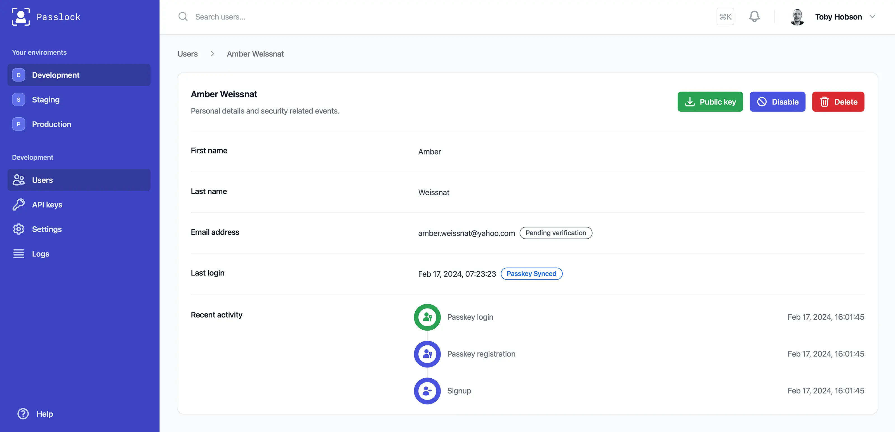

<!-- 
The pnpm script build:readme replaces tokens 
in README.template.md and outputs to README.md 2
-->
<div align="center">
  <a href="#{GITHUB_REPO}#">
    
  </a>
</div>

<h1 align="center">Passkeys, Social Login & More</h1>

<a name="readme-top"></a>
<div align="center">
  <picture align="center">
    <source srcset="README_assets/repo-banner.dark.svg" media="(prefers-color-scheme: dark)" />
    
  </picture>
  <p align="center">
    Typescript library for next generation authentication. Passkeys, Apple login, Google one-tap and more..
    <br />
    <a href="#{PASSLOCK_SITE}#"><strong>Project website »</strong></a>
    <br />
    <a href="#{GITHUB_REPO}#">GitHub</a>
    ·
    <a href="#{DEMO_SITE}#">Demo</a>
    ·
    <a href="#{DOCS}#">Documentation</a>
    ·
    <a href="#{TUTORIAL}#">Tutorial</a>
  </p>
</div>

<br />

> [!IMPORTANT]  
> **Looking for the SvelteKit templates?** Use the [@passlock/create-sveltekit](./packages/create-sveltekit/docs/README.md) script to create a new project

## Features

Passkeys and the WebAuthn API are quite complex. I've taken an opinionated approach to simplify things for you. Following the 80/20 principle, I've tried to focus on the features most valuable to developers and users.

1. **🔐 Primary or secondary authentication** - 2FA or a complete replacement for passwords

2. **🚀 Social login** - Supporting Apple & Google. GitHub coming soon..

3. **☝🏻 Biometrics** - Frictionless facial or fingerprint recognition for your webapps

4. **🖥️ Management console** - Suspend users, disable or revoke passkeys and more..

5. **🕵️ Audit trail** - View a full audit trail for each user

6. **🖥️ Dev console** - Something not working? check the web console for details

7. **👌 Headless components** - You have 100% control over the UI

## Screen recording

https://github.com/user-attachments/assets/f1c21242-74cb-4739-8eff-fddb19cb3256

## Screenshots


<p align="center">Demo app using this library for passkey and social login</p>


<p align="center">Viewing a user's authentication activity on their profile page</p>

## Usage

> [!TIP]
> **SvelteKit users** - Whilst this library is framework agnostic, SvelteKit users may want to check out the [@passlock/sveltekit](./packages/sveltekit/) wrapper This offers several enhancements, including UI components, form action helpers and Superforms support.

Use this library to generate a secure token, representing passkey registration or authentication. Send the token to your backend for verification (see below)

### Register a passkey

```typescript
import { Passlock, PasslockError } from '@passlock/client'

// you can find these details in the settings area of your Passlock console
const tenancyId = '...'
const clientId = '...'

const passlock = new Passlock({ tenancyId, clientId })

// to register a new passkey, call registerPasskey(). We're using placeholders for 
// the user data. You should grab this from an HTML form, React store, Redux etc.
const [email, givenName, familyName] = ["jdoe@gmail.com", "John", "Doe"]

// Passlock doesn't throw but instead returns a union: result | error
const result = await passlock.registerPasskey({ email, givenName, familyName })

// ensure we're error free
if (!PasslockError.isError(result)) {
  // send the token to your backend (json/fetch or hidden form field etc)
  console.log('Token: %s', result.token)
}
```

### Authenticate using a passkey

```typescript
import { Passlock, PasslockError } from '@passlock/client'

const tenancyId = '...'
const clientId = '...'

const passlock = new Passlock({ tenancyId, clientId })
const result = await passlock.authenticatePasskey()

if (!PasslockError.isError(result)) {
  // send the token to your backend for verification
  console.log('Token: %s', result.token)
}
```

### Backend verification

Verify the token and obtain the passkey registration or authentication details. You can make a simple GET request to `https://api.passlock.dev/{tenancyId}/token/{token}` or use the [@passlock/node][node] library:

```typescript
import { Passlock } from '@passlock/node'

// API Keys can be found in your passlock console
const passlock = new Passlock({ tenancyId, apiKey })

// token comes from your frontend
const principal = await passlock.fetchPrincipal({ token })

// get the user id
console.log(principal.user.id)
```

## More information

Please see the [tutorial][tutorial] and [documentation][docs]

[contact]: https://passlock.dev/contact
[tutorial]: https://docs.passlock.dev/docs/tutorial/introduction
[docs]: https://docs.passlock.dev
[node]: https://www.npmjs.com/package/@passlock/node
[melt]: https://melt-ui.com
[shadcn]: https://www.shadcn-svelte.com