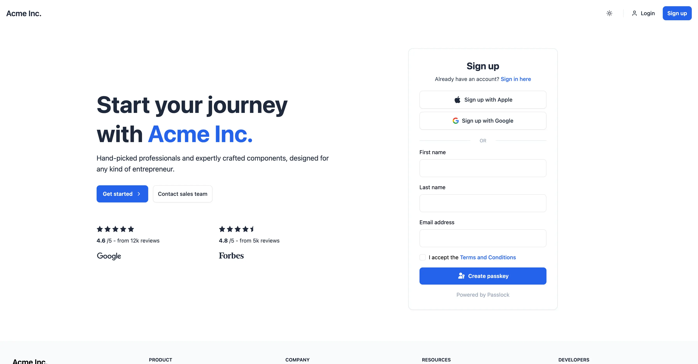
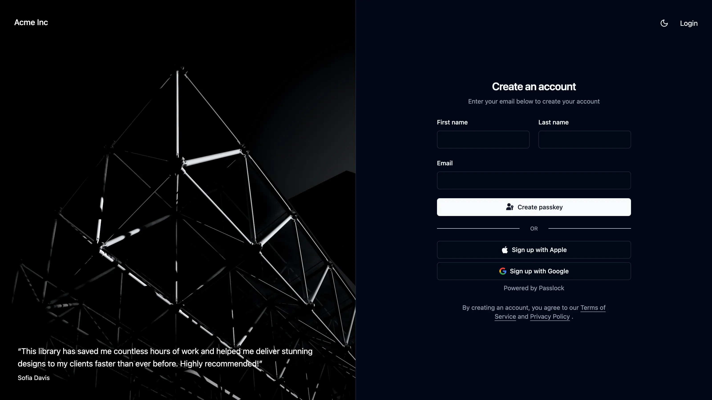

<!-- 
The pnpm script build:readme replaces tokens 
in README.template.md and outputs to README.md 
-->
<div align="center">
  <a href="#{GITHUB_REPO}#">
    
  </a>
</div>

<a name="readme-top"></a>

<h1 align="center">SvelteKit Authentication Starter App</h1>
<div align="center">
  <picture align="center">
    <source srcset="assets/repo-banner.dark.svg" media="(prefers-color-scheme: dark)" />
    
  </picture>
</div>
<p align="center">
  Sveltekit starter template featuring Passkeys, Social Login (Apple & Google) and more...
  <br />
  <a href="#{DEMO_SITE}#">Demo (Preline)</a> &nbsp; | &nbsp; <a href="#{SHADCN_DEMO_SITE}#">Demo (Shadcn)</a>
</p>

## Features

🔑 Passkey registration and authentication  
📱 Apple sign in  
☝️ Google sign in / one-tap  
📪 Mailbox verification (via a one time code or link)  
🌘 Dark mode with theme selection (light/dark/system)  
🚀 [Preline][preline] and [Shadcn][shadcn] variants

## Screenshots



<p align="center">Creating a new account and passkey</p>

<br />



<p align="center">Shadcn/ui variant (dark mode)</p>

## Frameworks used

1. [Passlock][passlock] - Serverless passkey platform
2. [Superforms][superforms] - Makes form handling a breeze
3. [Lucia][lucia] - Robust session management
4. [Tailwind][tailwind] - Utility-first CSS framework
5. [Preline][preline] - Tailwind UI library <sup>1</sup>
6. [shadcn][shadcn] - Tailwind components for Svelte
7. [Melt UI][meltui] - Headless component library for Svelte

<sup>[1]</sup> Uses native Svelte in place of Preline JavaScript  

<p align="right">(<a href="#readme-top">back to top</a>)</p>

## Requirements

* Node 18+
* [pnpm][pnpm] (optional)
* This example project uses the cloud based [Passlock][passlock] framework for passkey 
registration and authentication. **Passlock is free for personal and commercial use**.
Create an account at [https://passlock.dev][passlock-signup]

## Usage

Use the CLI to create a SvelteKit app. Choose from [Preline CSS][preline] or [Shadcn/ui][shadcn] variants

```bash
pnpm create @passlock/sveltekit
```

Then follow the instructions:


### Set the environment variables

You'll need to set three required and three optional variables:

1. PUBLIC_PASSLOCK_TENANCY_ID
2. PUBLIC_PASSLOCK_CLIENT_ID
3. PUBLIC_APPLE_CLIENT_ID (optional) <sup>1</sup>
4. PUBLIC_APPLE_REDIRECT_URL (optional) <sup>1</sup>
5. PUBLIC_GOOGLE_CLIENT_ID (optional) <sup>1</sup>
6. PASSLOCK_API_KEY

<sup>[1]</sup> If not using Apple/Google set to an empty string

Your Passlock **Tenancy ID**, **Client ID** and **API Key** (token) can be found in your [Passlock console][passlock-console] under [settings][passlock-settings] and [API Keys][passlock-apikeys]. 

**Update your `.env` file with the relevant credentials.**

> [!TIP]
> Alternatively you can download a ready made .env file from your passlock console [settings][passlock-settings]
>
> `Tenancy information -> Vite .env -> Download`
> 
> 

### Start the dev server

`pnpm run dev`

**Note:** by default this app runs on port 5174 when in dev mode (see [vite.config.ts](vite.config.ts))

<p align="right">(<a href="#readme-top">back to top</a>)</p>

## Navigate the app

### Register a passkey

Navigate to the [home page](http://localhost:5174/) page and complete the form. Assuming your browser supports passkeys (most do), you should be prompted to create a passkey.

### Authenticate

Logout then navigate to the [login](http://localhost:5174/login) page. You should be prompted to authenticate using your newly created passkey.

<br />

> [!TIP]
> Prompting for an email address during authentication is optional but **highly recommended**.
>
> Imagine the user hasn't created a passkey, or they signed up using Google. When they try to sign in using a passkey you might expect that they would receive an error telling them that no passkey can be found, but unfortunately that's not how browsers behave. Instead the browser/device will prompt them to use a passkey on another different device. In my experience this confuses 90% of users.
>
> By asking for an email address we can check if they have a passkey registered in the backed or they have a linked Google account. This allows us to display a helpful message telling them to either sign up or login using their Google credentials.

<p align="right">(<a href="#readme-top">back to top</a>)</p>

## Social Login

This template also supports Social Login from both Apple and Google..

## Sign in with Google

Allow your users to register/sign in using a Google account. The app uses the latest [sign in with google][google-signin] code, avoiding redirects.

### Adding Google sign in

1. Obtain your [Google API Client ID][google-client-id]
2. Update your `.env` or `.env.local` to include a `PUBLIC_GOOGLE_CLIENT_ID` variable.
3. Record your Google Client ID in your [Passlock settings][passlock-settings] under `Social Login -> Google Client ID`

> [!IMPORTANT]  
> Don't forget the last step!

### Testing Google sign in

If all went well you should be able to register an account and then sign in using your Google credentials.

**IMPORTANT!** If you previously used the same email address with another authenticator (i.e. passkey or apple), you'll need to first delete the user in your Passlock console. This app doesn't yet support account linking (but it's coming in a couple of weeks)

<p align="right">(<a href="#readme-top">back to top</a>)</p>

## Sign in with Apple

Similar to Google, users can sign in using an Apple account, however there are a few more steps and gotchas to be aware of...

1. **You need a (paid) Apple developer account**
2. **You must have an App ID**, however **you don't need an app**, just a registered App ID
3. **You can't test using localhost**, you'll need to tunnel a public, https url to your local server using something like ngrok
4. **We need to pass a redirect URL to Apple**, even though we're not using redirects 🤯. In practice this means registering `https://mysite.com` with Apple and using it for `PUBLIC_APPLE_REDIRECT_URL`. Everything will work, even on `https://mysite.com/login`
5. **Apple only returns user data for the first call**. In normal use this isn't an issue, but if during testing you delete your account and register again, you will also need to break the link in your apple account. Go to https://appleid.apple.com -> `Sign in with Apple -> Passlock Demo -> Stop using Sign in with Apple`

### Adding Apple sign in

1. Create an Apple App ID with "Sign in with Apple" enabled
2. Create an Apple Service ID with "Sign in with Apple" enabled
3. Register the relevant website domains and redirect URLs with the service account
4. Update your `.env` or `.env.local` to include the `PUBLIC_APPLE_CLIENT_ID` and `PUBLIC_APPLE_REDIRECT_URL` variables.
5. Record your Apple Client ID in your [Passlock settings][passlock-settings]: Social Login -> Apple Client ID

### Testing Apple sign in

If all went well you should be able to register an account and sign in using your Apple id.

**IMPORTANT!** If you previously used the same email address with another authenticator (i.e. passkey or Google), you'll need to first delete the user in your Passlock console. This app doesn't yet support account linking (but it's coming in a couple of weeks)

<p align="right">(<a href="#readme-top">back to top</a>)</p>

## Mailbox verification

This app also supports mailbox verification emails (via Passlock):


You can choose to verify an email address during passkey registration. Take a look at [src/routes/(other)/+page.svelte](<src/routes/(other)/+page.svelte>):

```typescript
// Email a verification link
const verifyEmailLink: VerifyEmail = {
  method: 'link',
  redirectUrl: String(new URL('/verify-email', $page.url))
}

// Email a verification code
const verifyEmailCode: VerifyEmail = {
  method: 'code'
}

// If you want to verify the user's email during registration
// choose one of the options above and take a look at /verify/email/+page.svelte
let verifyEmail: VerifyEmail | undefined = verifyEmailCode
```

### Customizing the verification emails

See the emails section of your [Passlock console][passlock-settings]

<p align="right">(<a href="#readme-top">back to top</a>)</p>

## Questions? Problems

Please file an [issue][issues] and I'll respond ASAP.

[pnpm]: https://pnpm.io/installation
[passlock]: https://passlock.dev
[lucia]: https://lucia-auth.com
[tailwind]: https://tailwindcss.com
[preline]: https://preline.co
[meltui]: https://melt-ui.com
[shadcn]: https://www.shadcn-svelte.com
[passlock-signup]: https://console.passlock.dev/register
[passlock-console]: https://console.passlock.dev
[passlock-settings]: https://console.passlock.dev/settings
[passlock-apikeys]: https://console.passlock.dev/apikeys
[google-signin]: https://developers.google.com/identity/gsi/web/guides/overview
[google-client-id]: https://developers.google.com/identity/gsi/web/guides/get-google-api-clientid#get_your_google_api_client_id
[issues]: https://github.com/passlock-dev/svelte-passkeys/issues
[superforms]: https://superforms.rocks
[apple-verification-codes]: https://www.cultofmac.com/819421/ios-17-autofill-verification-codes-safari-mail-app/
[google-passkeys]: https://safety.google/authentication/passkey/
